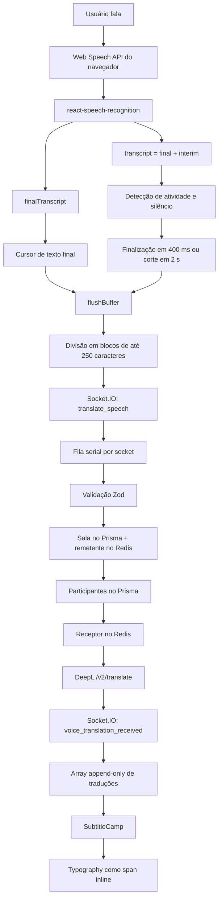
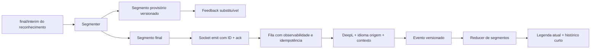

# Análise da arquitetura de tradução em tempo real

## Status do documento

- Data da análise: 28 de julho de 2026
- Atualização da implementação: 28 de julho de 2026
- Escopo: frontend e backend do Dicere
- Frontend analisado: branch `codex/corrigir-inicializacao-camera`, commit `96c97c5`
- Backend analisado: branch `card/leave-call`, commit `3608bc9`
- Natureza das métricas:
  - **observada no código**: constante, contrato ou comportamento coberto por teste;
  - **não medida**: depende de execução real e precisa de telemetria;
  - **hipótese**: conclusão a validar após instrumentação.

Este documento fica na raiz do frontend porque é nele que o pipeline de fala é iniciado e a legenda é renderizada. A análise também cobre o backend irmão em `../Dicere - backend`.

## Estado da implementação

As mudanças de baixo risco e os fundamentos do protocolo foram aplicados nos dois repositórios:

| Frente                 | Estado atual                                                                                                                                                                                                                                                          |
| ---------------------- | --------------------------------------------------------------------------------------------------------------------------------------------------------------------------------------------------------------------------------------------------------------------- |
| Legenda                | Cada tradução é um bloco separado, somente as 3 mais recentes ficam visíveis e a região anunciada por leitor de tela contém apenas a tradução mais recente.                                                                                                           |
| Identidade e ordenação | O protocolo aceita `segmentId`, `sequence`, `revision`, `status` e `traceId`; o receptor substitui revisões do mesmo segmento, rejeita revisões antigas, preserva segmentos finais e ordena por sequência.                                                            |
| Entrega                | O cliente usa acknowledgement com timeout de 8 segundos e até 2 retries com a mesma identidade. O servidor responde `ok`, `duplicate` ou `error` e mantém uma janela idempotente de 500 entregas por conexão.                                                         |
| Compatibilidade        | Clientes antigos continuam podendo enviar apenas `roomId` e `text`; o backend gera a identidade ausente e mantém o evento de erro legado.                                                                                                                             |
| Buffer                 | Somente resultados finais são enviados para tradução. Os segmentos são limitados a 250 caracteres, o histórico recebido a 100 itens e o contexto final anterior a 250 caracteres.                                                                                     |
| Contexto linguístico   | O frontend envia o idioma-fonte e o trecho final anterior; o backend normaliza o idioma para o formato do DeepL e encaminha ambos ao provedor.                                                                                                                        |
| Telemetria             | O frontend mantém um buffer local limitado com tempos do primeiro interim, primeiro final, segmentação, acknowledgement, recebimento e commit. O backend mede espera na fila, processamento e chamada ao DeepL e devolve esses tempos no acknowledgement e no evento. |

A persistência de entregas durante uma reconexão completa, a agregação de percentis em uma plataforma de observabilidade, a tradução paga de hipóteses `interim` e um experimento com DeepL Voice não foram ativados. Eles continuam dependentes das métricas de uso real, como recomendado nas fases 0, 4 e 5. A decomposição de `processingMs` por cada acesso Prisma/Redis também fica como aprofundamento de observabilidade.

## Resumo executivo

> Esta seção registra o baseline anterior à implementação. O estado atual está resumido acima.

O pipeline atual já é incremental em relação à especificação original: ele não aguarda aproximadamente 4 segundos. Um resultado final do reconhecimento é enviado imediatamente; na ausência dele, o frontend pede a finalização após 400 ms sem atualização e limita uma fala contínua a 2 segundos.

Os principais achados são:

1. **A causa direta de legendas como `DaniloNice` está na renderização, não no DeepL nem em um algoritmo de diff.** Cada tradução é um componente `Typography`, que hoje produz um `<span>` inline. Os elementos são renderizados lado a lado sem espaço textual, e `margin-bottom` não separa visualmente elementos inline. Corrigir a semântica de bloco ou adicionar um separador resolve esse defeito com baixa complexidade.
2. **Não é possível afirmar, com o código atual, se a maior latência real está no reconhecimento, no backend, no DeepL ou na rede.** O protocolo não carrega identificador do segmento, revisão nem timestamps, e não há histograma por etapa.
3. **A maior espera determinística antes do backend está na estabilização/finalização da fala:** envio imediato para `finalTranscript`, fallback de silêncio em 400 ms e corte de fala contínua em 2.000 ms. O tempo do motor de reconhecimento para produzir o resultado final continua desconhecido.
4. **O backend pode criar head-of-line blocking.** Todos os trechos de um mesmo socket são processados em uma fila estritamente serial; cada item repete consultas Prisma/Redis e uma chamada não streaming ao DeepL. Um trecho lento segura os seguintes.
5. **Socket.IO preserva ordem, mas o contrato atual é “at most once”.** Não há acknowledgement, retry protocolar, idempotência ou recuperação de traduções perdidas durante reconexão.
6. **`interimTranscript` já participa indiretamente do fluxo.** `transcript` é a concatenação de final + interim na biblioteca instalada, e o hook o usa para detectar atividade e para o fallback terminal. Entretanto, a hipótese provisória não é exibida nem enviada como uma revisão substituível.
7. **Não é recomendada uma dependência de diff na primeira evolução.** Para trechos finais append-only, IDs de segmento e substituição por revisão são mais simples e corretos. Se houver uma experiência visual de texto provisório, `diff`/jsdiff pode ser usado apenas para destacar palavras alteradas, não como fonte de verdade.
8. **A recomendação TLC é evoluir a stack atual em camadas:** instrumentar, corrigir a separação visual, introduzir identidade/acknowledgement, adotar buffer de segmentos e só depois experimentar tradução provisória. Para segmentação de frases, começar com `Intl.Segmenter`, sem nova dependência.

## Respostas diretas

### Onde está o maior gargalo?

Ainda não há dados para eleger o maior gargalo real. Pelo desenho do código, os candidatos são:

- tempo do navegador até um resultado reconhecido estável;
- espera de segmentação/finalização no frontend;
- DeepL;
- fila serial do backend quando chegam trechos em rajada.

O problema `DaniloNice` não é evidência de latência nem de falha de tradução: é um defeito de montagem/renderização.

### A latência está no frontend ou no backend?

Não é possível separar com precisão sem telemetria. O frontend adiciona entre 0 ms de espera intencional para um resultado final e até aproximadamente 2.150 ms para o fallback de fala contínua, além do tempo desconhecido do reconhecedor. O backend adiciona acessos a Prisma/Redis, espera na fila e a chamada ao DeepL, também sem medição.

### Vale continuar com `react-speech-recognition`?

Sim, para o MVP e para navegadores-alvo controlados. A biblioteca já expõe final/interim, estados de suporte e integração com polyfills. Não resolve, porém, as diferenças dos motores nativos entre navegadores. O próprio projeto da biblioteca recomenda polyfill para experiência comercial consistente e informa que o melhor suporte nativo é no Chrome.

Reavaliar a biblioteca se os testes de campo exigirem cobertura uniforme entre navegadores, controle do provedor de reconhecimento, transcrição local ou SLA. A API DeepL Voice é uma alternativa de médio prazo porque entrega transcrição e tradução streaming com segmentos concluídos e provisórios, mas muda substancialmente o pipeline e exige plano pago.

### Vale usar `interimTranscript`?

Sim, primeiro como **feedback provisório substituível**, não como texto definitivo append-only.

- Uso seguro imediato: mostrar ao falante que a voz está sendo reconhecida.
- Uso possível no receptor: tradução provisória com debounce, `segmentId` e `revision`, substituindo a versão anterior.
- Uso não recomendado: anexar cada interim ao histórico ou cobrar uma tradução para cada atualização.

Interim pode ser sobrescrito, reduzido ou removido antes do resultado final; tratá-lo como definitivo produz duplicação, palavras quebradas e “efeito datilógrafo” instável.

### Vale implementar diff incremental?

Não como base do protocolo. A identidade do segmento e sua revisão resolvem o estado com menor complexidade:

```text
segmento A, revisão 1, provisório -> substituir A
segmento A, revisão 2, provisório -> substituir A
segmento A, revisão 3, final      -> fixar A
```

Diff passa a ser opcional para animação/destaque das palavras alteradas dentro do mesmo segmento.

### Vale implementar buffer inteligente?

Sim. É a melhor evolução mantendo a stack: um pequeno buffer de segmentos finais e provisórios, com limites de tempo/tamanho e montagem explícita, substitui o array append-only sem exigir NLP pesado.

### Existe arquitetura mais eficiente mantendo a stack?

Sim: Web Speech API via `react-speech-recognition` + buffer de segmentos versionados + tradução somente de texto estável por padrão + Socket.IO com ack/IDs + DeepL com contexto anterior + legenda com segmento atual e histórico limitado.

## Metodologia e evidências

Foram rastreados:

- captura e temporização em `src/core/hooks/use-speech-translation.ts`;
- transporte e divisão em `src/core/services/speech-translation-service.ts`;
- contratos em `src/core/@types/socket-events.ts`;
- composição da tela em `src/core/features/room/components/video/video-section.tsx`;
- renderização em `src/core/features/room/components/video/subtitle-camp.tsx`;
- elemento tipográfico em `src/core/components/typography.tsx`;
- handler em `../Dicere - backend/src/modules/chat/interfaces/websocket/handlers/translate-speech-handler.ts`;
- caso de uso em `../Dicere - backend/src/modules/chat/application/use-cases/translate-speech/translate-speech-use-case.ts`;
- provedor em `../Dicere - backend/src/modules/chat/infra/providers/deepl-translation-provider.ts`;
- implementações Prisma e Redis usadas pelo caso de uso;
- testes unitários e e2e relacionados ao fluxo.

Também foram consultadas fontes primárias da Web Speech API, `react-speech-recognition`, DeepL, Socket.IO e das bibliotecas candidatas, listadas ao final.

O teste chamado `should translate 30 speech chunks concurrently and measure elapsed time` não representa produção: ele chama o caso de uso diretamente com repositórios e provedor fake, em `Promise.all`, e ignora a fila serial existente no handler. Portanto, seu tempo não deve ser usado como métrica do pipeline real.

## Arquitetura atual



## Análise etapa a etapa

### 1. Captura de voz

#### Funcionamento atual

- `useSpeechRecognition()` fornece `transcript`, `finalTranscript`, `listening` e suporte do navegador.
- A sessão é iniciada com `continuous: false` e o locale do idioma falado.
- A versão instalada de `react-speech-recognition` configura internamente `interimResults = true`.
- Na biblioteca, `transcript` é formado por `finalTranscript + interimTranscript`.
- O código conecta listeners nativos para `start`, `audiostart`, `result`, `speechend`, `nomatch`, `error` e `end`.
- Sessões não contínuas são rearmadas automaticamente.

#### Frequência de atualização

A frequência não é controlada pelo Dicere; depende do navegador e do serviço de reconhecimento. Cada evento de resultado pode atualizar a biblioteca e rerenderizar o componente que usa o hook. Não existe contador de eventos por segundo.

#### Uso de final e interim

- `finalTranscript` dispara envio imediato quando recebe conteúdo novo.
- `transcript`, que inclui interim, rearma o timer de silêncio e alimenta o fallback terminal.
- `interimTranscript` não é desestruturado isoladamente e não é renderizado.

#### Limitações

- Web Speech API tem suporte desigual e não é Baseline em todos os navegadores.
- Implementações nativas podem divergir em precisão, formatação, duração da sessão e erros.
- No Chrome, o reconhecimento padrão é processado por serviço remoto e não funciona offline.
- `continuous: false` aumenta o número de reinícios e pode criar pequenos hiatos entre sessões.
- O retry chama `applyPolyfill` com o construtor nativo; isso recria o wrapper, mas não adiciona um provedor de polyfill independente.
- O estado `browserSupportsContinuousListening` oferecido pela biblioteca não é consultado, embora a configuração atual não dependa de modo contínuo.

### 2. Buffer de texto

#### Estrutura atual

O hook mantém:

- transcrição total da sessão;
- transcrição final da sessão;
- último final observado;
- cursor por quantidade de caracteres enviados;
- texto pendente quando o socket está desconectado;
- timers de silêncio, fala contínua, encerramento e retries.

#### Limpeza

O cursor e as transcrições locais são resetados ao iniciar uma nova sessão, trocar configuração relevante, desativar o fluxo ou desmontar o componente.

#### Duplicação

Há boas proteções locais:

- o cursor evita reenviar o prefixo final acumulado;
- falha anterior ao emit guarda o texto pendente separadamente;
- a biblioteca instalada também suprime um tipo de resultado final duplicado.

Ainda faltam proteções distribuídas:

- não há `segmentId` ou chave de idempotência;
- não há ack do servidor;
- não é possível distinguir “emit perdido” de “processado, mas resposta perdida”;
- um retry protocolar futuro poderá duplicar traduções se for adicionado sem idempotência.

#### Perda de palavras

O divisor de 250 caracteres preserva palavras comuns e só corta uma palavra quando ela própria excede o limite. O risco relevante não está no divisor, mas nos limites de sessão e transporte:

- uma hipótese interim terminal pode ser enviada sem posterior correção;
- um evento pode se perder durante desconexão;
- não há recuperação de tradução perdida no receptor;
- o pequeno intervalo entre sessões não contínuas deve ser medido em cada navegador.

Dentro de uma mesma sessão, o cursor aplicado a resultados finais é razoável porque resultados finais são estáveis. Ele não deve ser generalizado para interims mutáveis.

### 3. Estratégia de envio

#### Regras observadas

| Gatilho                            | Ação                                           |                        Espera intencional |
| ---------------------------------- | ---------------------------------------------- | ----------------------------------------: |
| novo `finalTranscript`             | envia somente o trecho final ainda não enviado |                                      0 ms |
| `speechend`                        | pede parada do reconhecimento                  |                                    150 ms |
| transcript sem nova atualização    | pede parada                                    |                                    400 ms |
| fala segue recebendo atualizações  | pede parada                                    | 2.000 ms desde o primeiro trecho pendente |
| evento `end` normal                | envia fallback terminal e rearma               |                                    150 ms |
| sessão silenciosa                  | rearma sem envio                               |                                    250 ms |
| erro transitório de reconhecimento | retry                                          |                     1, 2, 4, 8, 16 e 30 s |
| socket desconectado antes do emit  | retry do texto pendente                        |                                  1.000 ms |

O valor de aproximadamente 4 segundos citado na especificação não existe nesta versão do código.

#### Quantidade de chamadas

- Um flush produz uma chamada Socket.IO por bloco de até 250 caracteres.
- Cada evento aceito pelo backend produz uma chamada independente ao DeepL.
- Não há batch, debounce de requests ao backend, cache ou agregação de frase no servidor.
- Em fala normal, o limite temporal de 2 s tende a gerar blocos bem menores que 250 caracteres; isso é uma hipótese e precisa ser medida.

#### Impacto na experiência

- Finais curtos podem aparecer rápido.
- Fala contínua chega em blocos, não palavra a palavra.
- Rajadas de blocos acima de 250 caracteres viram várias traduções e atravessam uma fila serial.
- Forçar finalização com 400 ms pode cortar pausas naturais curtas; o novo segmento perde contexto do anterior.

### 4. Comunicação com o backend

#### Payload de entrada

```ts
{
  roomId: string;
  text: string; // 1..250 caracteres após trim
}
```

#### Payload de saída

```ts
{
  roomId: string;
  fromParticipantId: string;
  fromParticipantName: string;
  originalText: string;
  translatedText: string;
  targetLanguage: string;
}
```

#### Dados ausentes

- `segmentId`;
- `sequence` originada no remetente/servidor;
- `revision`;
- status `provisional`/`final`;
- timestamps;
- duração por etapa;
- acknowledgement/correlation ID;
- contexto da frase anterior.

O frontend cria `sequence` apenas depois que a tradução já chegou. Esse número serve como chave React e preserva a ordem local recebida, mas não detecta lacunas.

#### Rede e entrega

O cliente força transporte WebSocket. Socket.IO garante ordem dos eventos que chegam, porém usa entrega “at most once” por padrão. O projeto não configurou retries/ack do cliente e não persiste offsets no receptor.

### 5. Backend

#### Caminho crítico por trecho

1. Entrada em fila serial associada ao socket remetente.
2. Parse e validação Zod.
3. Busca de sala no Prisma e presença do remetente no Redis, em paralelo.
4. Busca dos participantes da sala no Prisma.
5. Busca da presença do receptor no Redis.
6. Chamada ao DeepL.
7. Verificação do socket receptor em memória.
8. Emissão ao receptor.

#### Pontos positivos

- validação de payload e limite consistente de 250 caracteres;
- autorização contextual do remetente;
- tradução enviada somente ao outro participante;
- ordem preservada por socket mesmo com chamadas assíncronas;
- timeout do provedor;
- erros do domínio mapeados para o evento de erro.

#### Gargalos e riscos

- três estágios de acesso a dados antes do DeepL;
- dados de sala, participantes e conexão são relidos para cada trecho;
- a fila serial preserva ordem, mas soma o tempo de todos os trechos anteriores;
- não há limite explícito da fila, backpressure ou descarte de revisão obsoleta;
- não há instrumentação da espera na fila;
- o handler instancia/resgata o caso de uso para cada item;
- a topologia usa `io.sockets.sockets.get`, o que pressupõe que o receptor esteja no mesmo processo Socket.IO; escalar horizontalmente exigirá adapter e revisão dessa consulta local.

### 6. Tradução DeepL

#### Funcionamento atual

- endpoint `https://api-free.deepl.com/v2/translate`;
- uma string no array `text`;
- `target_lang` do participante receptor;
- detecção automática do idioma de origem;
- timeout de 5.000 ms;
- sem `context`, `source_lang`, `model_type` ou client oficial.

#### Tempo

Não existe medição do tempo médio, p50 ou p95 do DeepL. O único dado concreto é o timeout de 5 s. Timeout não é latência média.

#### Oportunidades

- medir DNS/conexão + TTFB + parsing como um único `provider_ms`;
- confirmar reutilização de conexão HTTP e, se necessário, usar um cliente/pool persistente; a própria DeepL recomenda conexão persistente para baixa latência;
- enviar `source_lang` quando o idioma falado estiver definido, evitando autodetecção por trecho curto;
- usar a última frase final como `context`, que pode melhorar traduções curtas sem cobrar os caracteres de contexto;
- testar `model_type: latency_optimized` se disponível no plano/endpoint e medir qualidade versus tempo;
- não paralelizar cegamente trechos do mesmo falante, pois respostas fora de ordem e perda de contexto podem piorar a legenda;
- permitir paralelismo entre salas ou remetentes, o que o desenho atual já possibilita porque a fila é por socket.

### 7. Atualização da interface

#### Fluxo atual

- O listener recebe `voice_translation_received`.
- O hook adiciona um item ao fim de `translations`.
- `VideoSection` rerenderiza.
- `SubtitleCamp` mapeia todo o histórico.
- Um efeito move o scroll imediatamente ao final.

#### Quantidade de renders

Não existe contador de renders. Pela estrutura:

- cada atualização interim/final da biblioteca atualiza estado do hook e pode rerenderizar `VideoSection`, mesmo que a transcrição não seja exibida;
- cada evento nativo `result` também transiciona a máquina para um novo objeto `healthy`;
- cada tradução recebida recria o array e remapeia todo o histórico;
- o histórico não tem limite e o DOM cresce durante toda a chamada.

Isso pode não ser perceptível em uma conversa curta, mas deve ser medido e limitado.

### 8. Montagem das legendas

#### Causa confirmada da concatenação

`SubtitleCamp` renderiza:

```tsx
<Typography className="mb-4">{translation.translatedText}</Typography>
```

`Typography` sempre devolve um `<span>`. Como `span` é inline:

- dois itens adjacentes não ganham um espaço automaticamente;
- `mb-4` não cria separação vertical normal;
- o texto acessível/extraído pode virar `DaniloNice`;
- cada tradução é visualmente um fragmento, não uma unidade semântica de legenda.

Antes de qualquer diff ou NLP, a correção mínima é usar elemento de bloco/container com `display: block`, `flex/grid + gap` ou separador textual explícito. Também é necessário decidir se a UI deseja:

- histórico de frases;
- somente a legenda atual;
- legenda atual + uma ou duas anteriores.

#### Modelo atual

O modelo é append-only: cada retorno do DeepL vira um item definitivo. Não existe merge entre blocos, substituição, expiração, pontuação artificial ou deduplicação de conteúdo no receptor.

#### Modelo recomendado

```ts
type CaptionSegment = {
  id: string;
  sequence: number;
  revision: number;
  status: "provisional" | "final";
  sourceText: string;
  translatedText?: string;
  startedAt?: number;
  finalizedAt?: number;
};
```

Regras:

1. `id + revision` substitui o estado do mesmo segmento.
2. Segmento final nunca volta a provisório.
3. `sequence` ordena segmentos e detecta lacunas.
4. Duplicata de `id + revision` é ignorada.
5. Fronteira entre segmentos sempre tem separador semântico.
6. A UI mantém uma janela curta; histórico completo, se necessário, fica fora do DOM da legenda.
7. Pontuação vem preferencialmente do reconhecedor/DeepL. Separação por pausa pode encerrar um segmento sem inventar pontuação.

## Modelo de latência

```text
T percebido =
  T até atualização do reconhecimento
  + T estabilização/finalização
  + T cliente -> servidor
  + T espera na fila
  + T Prisma/Redis
  + T DeepL
  + T servidor -> receptor
  + T atualização/render
```

### Valores conhecidos

| Medida                             |          Valor | Origem            |
| ---------------------------------- | -------------: | ----------------- |
| espera para novo `finalTranscript` | 0 ms adicional | código            |
| fallback de silêncio               |         400 ms | código/teste      |
| graça após `speechend`             |         150 ms | código/teste      |
| corte de fala contínua             |       2.000 ms | código/teste      |
| graça antes do flush terminal      |         150 ms | código/teste      |
| rearm silencioso                   |         250 ms | código/teste      |
| tamanho máximo por request         | 250 caracteres | frontend/backend  |
| timeout DeepL                      |       5.000 ms | backend           |
| ordem por remetente                |         serial | handler/teste e2e |
| histórico de legendas              |      ilimitado | código            |

Para o fallback de silêncio sem resultado final, o frontend adiciona nominalmente 400 ms até pedir `stop` e mais 150 ms após `end` antes do flush terminal. Entre esses pontos existe o tempo não controlado que o navegador leva para encerrar e eventualmente produzir um final.

### Valores ausentes

- tempo fala -> primeiro interim;
- tempo fala -> final;
- frequência de resultados;
- tempo cliente -> servidor;
- espera na fila;
- duração Prisma;
- duração Redis;
- duração DeepL p50/p95/p99;
- tempo servidor -> receptor;
- tempo até primeiro paint da legenda;
- chamadas/minuto, caracteres/request, erro e perda.

### Latência real versus percebida

A percepção piora quando não há feedback durante a espera e quando o resultado chega como bloco grande. No Dicere:

- o receptor não vê estado “ouvindo/traduzindo”;
- o interim não é exibido;
- múltiplos retornos podem chegar em rajada por causa da fila;
- fragmentos inline parecem colados;
- o scroll salta a cada bloco;
- uma tradução anterior permanece indefinidamente enquanto a próxima está em processamento.

Assim, é possível melhorar muito a sensação de velocidade sem reduzir o tempo do DeepL:

- exibir indicador discreto de fala detectada/tradução em andamento;
- mostrar um segmento provisório substituível;
- manter apenas 1–3 segmentos visíveis;
- animar substituição, não anexação palavra por palavra;
- preservar espaço/pontuação entre segmentos.

## Atualizações progressivas

### Viabilidade com `react-speech-recognition`

É viável. A biblioteca expõe `interimTranscript`, `finalTranscript` e `transcript`. Entretanto, a Web Speech API define o interim como hipótese mutável: uma atualização posterior pode sobrescrevê-lo ou removê-lo.

### Estratégia recomendada em duas pistas

```text
Pista imediata:
interim local -> segmento provisório -> substituir na UI

Pista confiável:
final -> backend/DeepL -> segmento final traduzido -> fixar na UI
```

Para o receptor, há duas opções:

1. **MVP recomendado:** indicador/provisório de atividade e somente tradução de finais.
2. **Experimento posterior:** traduzir a hipótese mais recente após debounce, com uma única revisão em voo por segmento; respostas antigas são descartadas por `revision`.

Um exemplo de parâmetros para experimento, não uma decisão final:

- debounce de 600–800 ms;
- mínimo de caracteres/palavras;
- no máximo uma requisição provisória em voo por falante;
- final sempre tem prioridade;
- revisão antiga nunca é anexada ao histórico;
- medir custo, flicker, correções e tempo percebido.

Traduzir a cada interim não é recomendado: aumenta custo e fila, produz respostas obsoletas e pode deixar o resultado mais lento.

## Bibliotecas e recursos pesquisados

| Opção                  | Capacidade                                                                             | Adequação ao Dicere                                                           | Decisão                             |
| ---------------------- | -------------------------------------------------------------------------------------- | ----------------------------------------------------------------------------- | ----------------------------------- |
| `Intl.Segmenter`       | segmentação nativa por palavra/frase e locale                                          | sem dependência, multilíngue, disponível nos navegadores modernos             | **recomendado** como primeira opção |
| `diff` (jsdiff)        | `diffWords`, `diffSentences`, `diffArrays`; aceita `Intl.Segmenter` e limites de custo | útil para destacar revisão de interim; desnecessário para append de finais    | opcional, somente após protótipo    |
| `fast-diff`            | diff rápido de strings em caracteres                                                   | pequeno, mas não entende palavra/frase e não resolve identidade de segmento   | não adotar agora                    |
| `diff-match-patch`     | diff, fuzzy match e patch                                                              | poderoso demais para o caso e repositório oficial arquivado desde 2024        | não adotar                          |
| `sentence-splitter`    | AST e divisão de sentenças                                                             | foco declarado em inglês/japonês; peso conceitual maior que a necessidade     | não adotar                          |
| `sbd`                  | regras de boundary detection com abreviações/números/URLs                              | abordagem centrada em inglês e publicação antiga; fala pode vir sem pontuação | não adotar                          |
| regra própria de regex | simples                                                                                | falha com abreviações, idiomas e pontuação sem espaço                         | apenas fallback mínimo              |

Conclusão TLC: nenhuma biblioteca é necessária para corrigir a montagem atual. Quando houver buffer de frases, testar `Intl.Segmenter` antes de instalar pacote. Quando houver texto provisório, substituir pelo ID/revisão antes de considerar diff.

## Comparação das arquiteturas

### 1. Arquitetura atual

```text
Speech Recognition -> buffer/cursor -> pausa/final -> backend -> DeepL -> Socket
```

- Vantagens: implementada, testada, simples no contrato, preserva ordem por remetente.
- Desvantagens: blocos append-only, sem telemetria/ack/IDs, fila serial, pouco contexto, histórico ilimitado.
- Complexidade: baixa a média.
- Impacto esperado: funcional, mas percepção inconsistente.
- Recomendação: manter como base, corrigindo primeiro UI e observabilidade.

### 2. Buffer incremental com envios frequentes

```text
Speech Recognition -> atualizações frequentes -> backend
```

- Vantagens: primeiro texto pode chegar antes.
- Desvantagens: muitas chamadas, custo, revisões obsoletas, mais fila e traduções contraditórias.
- Complexidade: média, porque requer debounce, cancelamento lógico e revisão.
- Impacto esperado: pode melhorar o primeiro feedback e piorar estabilidade/custo.
- Recomendação: não usar como padrão; somente experimento controlado de provisórios.

### 3. Diff incremental

```text
texto anterior -> diff -> mudança visual
```

- Vantagens: transições visuais suaves e menor atualização aparente.
- Desvantagens: diff não garante semântica, ordem ou idempotência; interims podem reescrever prefixos.
- Complexidade: média.
- Impacto esperado: cosmético, pequeno sobre latência real.
- Recomendação: opcional na UI após existir modelo `segmentId/revision`.

### 4. Buffer inteligente

```text
segmentos finais/provisórios -> merge por ID -> janela de legenda
```

- Vantagens: resolve montagem, deduplicação, substituição, limite de histórico e contexto.
- Desvantagens: exige novo contrato e regras de ciclo de vida.
- Complexidade: média e controlável.
- Impacto esperado: alto na legibilidade, estabilidade e capacidade de evolução.
- Recomendação: **arquitetura-alvo mantendo a stack atual**.

### 5. Atualizações progressivas

```text
interim -> provisório
final -> tradução definitiva
```

- Vantagens: menor latência percebida e feedback contínuo.
- Desvantagens: flicker, retradução, custo e acessibilidade se atualizar rápido demais.
- Complexidade: média a alta no receptor.
- Impacto esperado: alto se houver debounce e substituição; negativo se cada token for anexado.
- Recomendação: adotar primeiro só o conceito provisório/final; traduzir interims apenas após métricas.

### 6. DeepL Voice API streaming

```text
áudio -> DeepL Voice WebSocket -> target transcript concluded/tentative -> Socket/UI
```

- Vantagens: API já modela segmentos concluídos e provisórios, une reconhecimento e tradução, suporta tradução streaming.
- Desvantagens: requer captura/streaming de áudio, novo contrato, DeepL API Pro, cobrança por minutos, revisão de privacidade e fallback.
- Complexidade: alta.
- Impacto esperado: potencialmente o melhor fluxo realmente progressivo.
- Recomendação: spike separado de médio prazo; não substituir a arquitetura atual antes das fases de baixo custo.

## Recomendação técnica

### Arquitetura-alvo



Princípios:

- finais são a fonte de verdade;
- interims são substituíveis;
- identidade e revisão precedem diff;
- ordem e entrega são explícitas;
- somente trabalho atual permanece na fila;
- contexto anterior melhora qualidade sem juntar blocos visualmente;
- a UI apresenta segmentos, não strings soltas.

## Plano de evolução incremental

### Fase 0 — Baseline de observabilidade

Objetivo: responder onde está a latência antes de otimizar.

- adicionar `segmentId`, `sequence` e `traceId`;
- medir no navegador:
  - primeiro interim;
  - final;
  - emit;
  - recebimento;
  - commit/render;
- medir no backend:
  - entrada;
  - espera na fila;
  - Prisma;
  - Redis;
  - DeepL;
  - emissão;
- registrar tamanho, motivo do flush e status;
- produzir p50/p95/p99, chamadas/minuto, caracteres/request e taxa de erro;
- separar relógios: calcular durações locais com relógio monotônico e correlacionar por ID, sem presumir sincronização perfeita entre cliente e servidor.

Critério: relatório de chamadas reais por navegador, idioma e qualidade de rede.

### Fase 1 — Correção da montagem visual

Objetivo: remover concatenação sem mudar backend.

- renderizar cada tradução como bloco semântico ou usar container com `gap`;
- garantir separador entre fragmentos;
- limitar a janela visível;
- manter teste que falhe para `DaniloNice`;
- verificar `aria-live` para não reler todo o histórico.

Complexidade: baixa. Impacto: alto e imediato.

### Fase 2 — Contrato confiável

Objetivo: permitir retry e diagnóstico sem duplicação.

- incluir `segmentId`, `sequence`, `revision`, `status` e `traceId`;
- ack do servidor para `translate_speech`;
- idempotência no backend;
- detectar lacunas no receptor;
- definir política de reconexão e expiração;
- não habilitar retry at-least-once sem idempotência.

Complexidade: média. Impacto: alto em confiabilidade.

### Fase 3 — Buffer inteligente

Objetivo: separar estado textual de apresentação.

- reducer por ID/revisão;
- segmento atual provisório + finais;
- janela de 1–3 segmentos;
- `Intl.Segmenter` para limites de sentença quando houver pontuação;
- pausa/tamanho como fallback;
- passar idioma de origem ao DeepL;
- experimentar a frase final anterior no campo `context`.

Complexidade: média. Impacto: alto em legibilidade e qualidade.

### Fase 4 — Progressivo controlado

Objetivo: reduzir latência percebida baseada em métricas.

- mostrar interim local;
- testar tradução de interim com debounce;
- no máximo uma revisão provisória relevante por segmento;
- descartar resposta obsoleta;
- comparar A/B:
  - tempo até primeiro conteúdo;
  - tempo até conteúdo final;
  - quantidade de revisões;
  - custo/caracteres;
  - avaliação de flicker.

Parar o experimento se custo e instabilidade superarem o ganho percebido.

### Fase 5 — Escala e alternativas

- cachear metadados imutáveis da sessão durante a chamada, com invalidação ao sair/trocar idioma;
- avaliar se a fila deve manter somente a revisão provisória mais recente;
- testar `latency_optimized` e conexão persistente do DeepL;
- adicionar polyfill real se a matriz de navegadores exigir;
- fazer spike do DeepL Voice API;
- preparar adapter Socket.IO e resolução de presença distribuída antes de escalar horizontalmente.

## Plano mínimo de medição

| Métrica                         | Pergunta respondida                   |
| ------------------------------- | ------------------------------------- |
| `speech_to_first_interim_ms`    | o reconhecimento começa rápido?       |
| `speech_to_final_ms`            | o motor demora a estabilizar?         |
| `frontend_segmentation_ms`      | timers estão dominando?               |
| `queue_wait_ms`                 | a serialização cria atraso acumulado? |
| `repository_ms`                 | Prisma/Redis são relevantes?          |
| `deepl_ms`                      | o provedor é o gargalo?               |
| `server_to_client_ms`           | a rede/socket é relevante?            |
| `client_receive_to_paint_ms`    | a UI está lenta?                      |
| `end_to_end_ms`                 | qual é o tempo real total?            |
| `time_to_first_feedback_ms`     | qual é a latência percebida?          |
| `requests_per_minute`           | qual é o custo operacional?           |
| `revisions_per_segment`         | o progressivo está instável?          |
| `dropped_or_duplicate_segments` | o transporte é confiável?             |

Coletar por navegador, dispositivo, idioma, tamanho do trecho e tipo de rede. Usar percentis, não apenas média.

## Riscos

| Risco                                | Consequência                        | Mitigação                                     |
| ------------------------------------ | ----------------------------------- | --------------------------------------------- |
| interim tratado como final           | duplicação e correções visíveis     | status/revision e substituição                |
| mais requests provisórios            | custo e fila maiores                | debounce, mínimo e uma revisão em voo         |
| retry sem idempotência               | legenda duplicada                   | ID + ack + dedupe                             |
| fila serial longa                    | atraso acumulado                    | medir espera, compactar provisórios obsoletos |
| paralelismo indiscriminado           | respostas fora de contexto          | sequência e paralelismo por sala/remetente    |
| segmentação só por pontuação         | fala sem fronteiras                 | combinar pause/tamanho/`Intl.Segmenter`       |
| idioma falado incorreto              | reconhecimento e tradução piores    | validar seleção e enviar `source_lang`        |
| histórico ilimitado                  | DOM/memória crescentes              | janela/virtualização/armazenamento separado   |
| diferenças de navegador              | comportamento inconsistente         | matriz de suporte e polyfill real             |
| perda durante reconexão              | trechos ausentes                    | ack/offset/persistência conforme requisito    |
| atualização excessiva de `aria-live` | experiência ruim com leitor de tela | anunciar só segmento estabilizado             |
| DeepL Voice como migração prematura  | custo e escopo altos                | spike isolado com critérios mensuráveis       |

## Decisões TLC

1. Corrigir o elemento inline antes de adicionar biblioteca.
2. Medir antes de reduzir timers.
3. Identificar/revisionar segmentos antes de implementar diff.
4. Traduzir finais antes de traduzir interims.
5. Usar `Intl.Segmenter` antes de instalar um sentence splitter.
6. Adicionar ack somente junto de idempotência.
7. Manter serialização enquanto ordem for necessária, mas medir e compactar trabalho provisório obsoleto.
8. Considerar DeepL Voice apenas quando a stack atual tiver baseline comparável.

## Critérios de aceite da análise

- [x] Fluxo completo da tradução analisado
- [x] Componentes do pipeline documentados
- [x] Gargalos potenciais e gargalo visual confirmado
- [x] Latência real e percebida separadas
- [x] Montagem das legendas analisada
- [x] Bibliotecas e alternativa nativa pesquisadas
- [x] Arquiteturas comparadas com vantagens, desvantagens, complexidade e recomendação
- [x] Padrão TLC aplicado
- [x] Recomendação técnica definida
- [x] Plano incremental e plano de medição elaborados
- [x] Riscos documentados

## Conclusão

O sistema não precisa de uma reescrita para melhorar substancialmente. A concatenação atual é um problema simples de semântica HTML; o restante pede evolução disciplinada do modelo de segmentos e do contrato.

A sequência recomendada é:

```text
telemetria
  -> separação visual
  -> IDs/ack/idempotência
  -> buffer de segmentos
  -> progressivo medido
  -> alternativa streaming, se necessária
```

Isso mantém o MVP operacional, evita custo prematuro e cria evidência para decidir se `react-speech-recognition` + DeepL Text continua suficiente ou se uma solução de voz streaming passa a justificar a migração.

## Fontes externas

- [`react-speech-recognition`: documentação oficial](https://github.com/JamesBrill/react-speech-recognition)
- [Web Speech API: especificação de resultados finais e interims](https://dvcs.w3.org/hg/speech-api/raw-file/tip/speechapi)
- [MDN: `SpeechRecognition.interimResults`](https://developer.mozilla.org/en-US/docs/Web/API/SpeechRecognition/interimResults)
- [MDN: `Intl.Segmenter`](https://developer.mozilla.org/en-US/docs/Web/JavaScript/Reference/Global_Objects/Intl/Segmenter)
- [DeepL: endpoint de tradução de texto](https://developers.deepl.com/api-reference/translate/request-translation)
- [DeepL: checklist para baixa latência e conexão persistente](https://developers.deepl.com/docs/best-practices/pre-production-checklist)
- [DeepL: uso do parâmetro `context`](https://developers.deepl.com/docs/learning-how-tos/examples-and-guides/how-to-use-context-parameter)
- [DeepL Voice: criação de sessão realtime](https://developers.deepl.com/api-reference/voice/request-session)
- [DeepL Voice: protocolo WebSocket e segmentos tentative/concluded](https://developers.deepl.com/api-reference/voice/websocket-streaming)
- [DeepL: changelog e disponibilidade da Voice API](https://developers.deepl.com/docs/resources/roadmap-and-release-notes)
- [Socket.IO: ordem e garantias de entrega](https://socket.io/docs/v4/delivery-guarantees/)
- [`diff`/jsdiff](https://github.com/kpdecker/jsdiff)
- [`fast-diff`](https://github.com/jhchen/fast-diff)
- [`diff-match-patch` (arquivado)](https://github.com/google/diff-match-patch)
- [`sentence-splitter`](https://github.com/textlint-rule/sentence-splitter)
- [`sbd`](https://www.npmjs.com/package/sbd)
